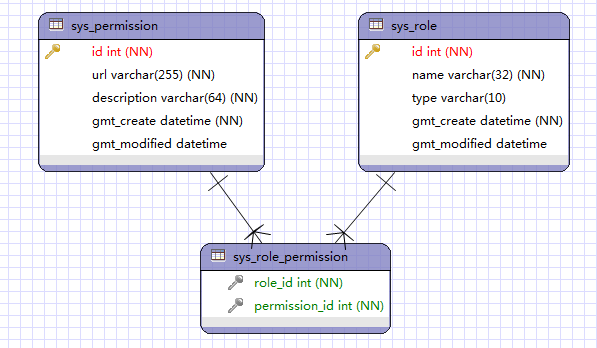
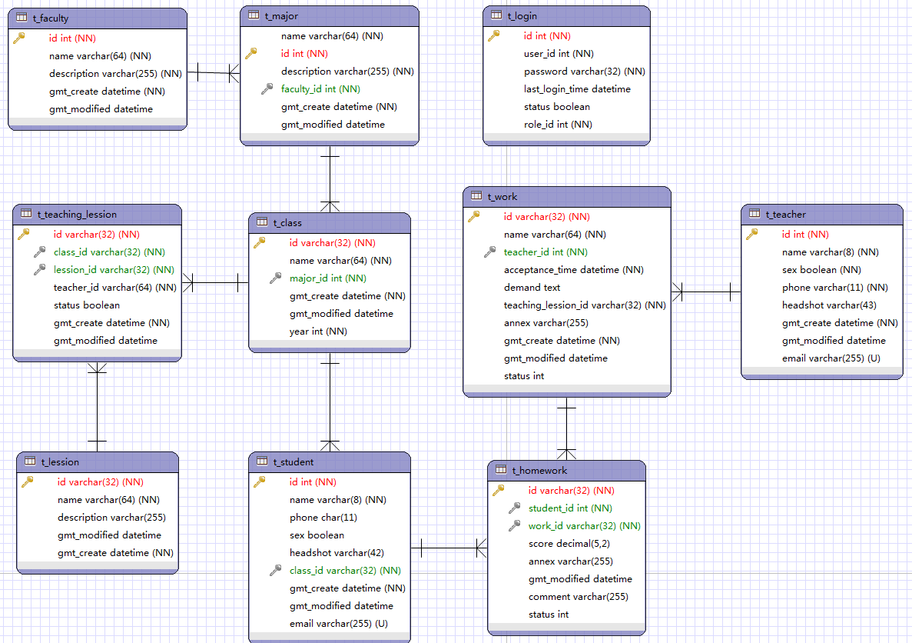
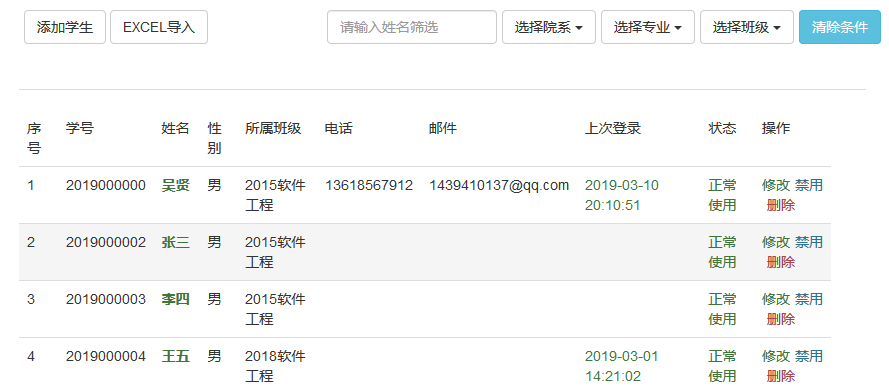
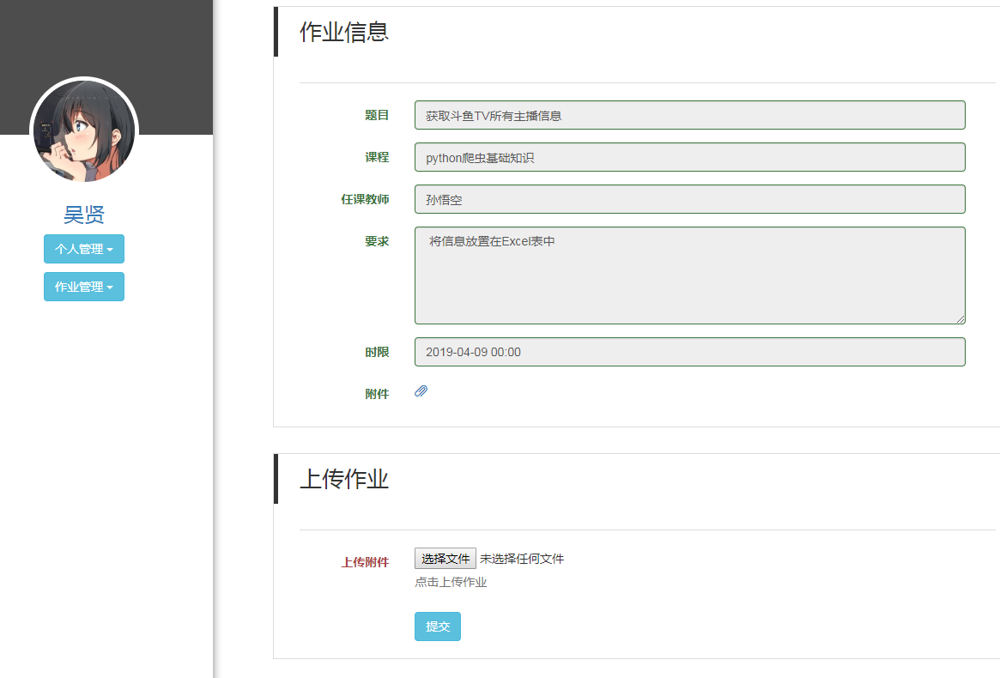
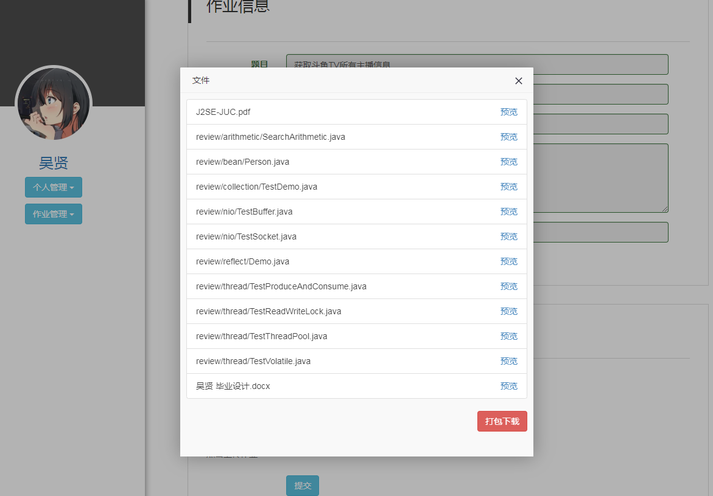

# studentJobManagerSys
2019 毕业设计-学生作业管理系统（重构第二版中...<https://gitee.com/wx_com/jobmanager>）

采用SSM+Shiro进行对大学生作业（电子文档）的管理，实现教师发布作业和学生上传作业等作业的管理需求。

使用HTML+CSS+JavaScript+jQuery完成系统页面的设计。

使用Spring+SpringMVC+MyBatis完成院系、专业、班级、科目、课程、用户（学生、教师）、作业等功能及其实现，其中作业模块尚有部分功能未完善。

使用Shiro完成用户权限的管理；采用POI对数据一键导入；OpenOffice对电子文档（office）转PDF实现在线预览。

（tips：项目搭建曾搭建在阿里Linux服务器上，服务器已过期，电脑也重装，懒得再部署了）

1. 需添加一个虚拟目录用于存放文件。
2. 需安装openoffice，用以程序调用将office文档转换为pdf实现在线预览。

第二版在重构中，采用更为规范健壮的编码方式（<https://gitee.com/wx_com/jobmanager>）。

当前项目效果图

